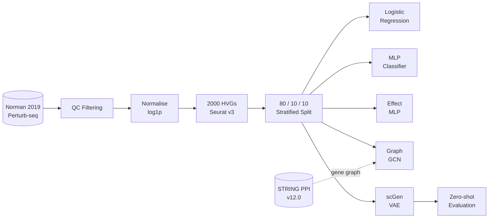

<div align="center">

# Perturbation-Based Drug Target Discovery

**Predicting genome-wide transcriptional responses to CRISPR knockouts with deep learning**

[](https://www.python.org/)
[](https://pytorch.org/)
[](https://scanpy.readthedocs.io/)
[](https://anndata.readthedocs.io/)
[](https://scikit-learn.org/)
[](LICENSE)

*111,391 cells &nbsp;·&nbsp; 2,000 highly variable genes &nbsp;·&nbsp; 237 CRISPR perturbations &nbsp;·&nbsp; K562 cell line*

</div>

---

## What This Does

Wet-lab CRISPR screens are expensive and slow — testing every candidate gene as a drug target is not feasible at scale. This project trains five deep learning models to predict what a gene knockout does to a cell's entire expression profile, so thousands of candidates can be screened computationally before a single experiment runs.

It reimplements the core prediction paradigm behind [scGen](https://www.nature.com/articles/s41592-019-0494-8), [CPA](https://www.embopress.org/doi/full/10.15252/msb.202211517), and [GEARS](https://www.nature.com/articles/s41587-023-01905-6) from scratch — covering everything from a linear baseline to a variational autoencoder with zero-shot generalisation.

---

## Pipeline



---

## Results

### At a glance

The best model (**Effect MLP**) predicts post-perturbation gene expression at **r = 0.9957** per perturbation. A naive baseline that predicts no change from control already scores **r = 0.9829** — because most genes are unaffected by any single knockout. The 0.013 gap between them is where all the biologically meaningful signal lives.

---

### Task 1 — Predicting gene expression after a knockout

> Given a control cell and a perturbation identity, predict the cell's full 2,000-gene expression profile after the knockout.

| Model | Per-perturbation r | Gene-level r | Test MSE |
|:---|:---:|:---:|:---:|
| Naive baseline *(predict control mean)* | 0.9829 | — | — |
| Effect MLP | **0.9957** | 0.118 | 0.077 |
| Graph GCN *(STRING PPI prior)* | 0.9903 | 0.087 | 0.079 |
| scGen VAE | 0.9798 | 0.031 | 0.083 |

**Per-perturbation r** measures whether the model predicts the right pattern of up- and down-regulated genes for each knockout. **Gene-level r** (the harder number) measures whether it correctly ranks individual gene magnitudes across all cells — this stays below 0.12 for all models, a known limitation of the mean-prediction paradigm also present in scGen and GEARS.

---

### Task 2 — Identifying which perturbation a cell received

> Given a cell's expression profile, classify which of 237 perturbations caused it. Random chance = 0.4%.

| Model | Top-1 Accuracy | Top-5 Accuracy |
|:---|:---:|:---:|
| Logistic Regression | 37.4% | 64.7% |
| MLP Classifier | **45.9%** | **70.7%** |

The jump from logistic regression (+8.5 pp) confirms the expression signal supports neural modelling and validates that the preprocessing pipeline is preserving perturbation-discriminative structure.

---

### Task 3 — Generalising to unseen perturbations (zero-shot)

> Can the model predict the effect of a perturbation it never trained on?

The scGen VAE is the only model that supports this — by transferring the latent embedding of the nearest seen perturbation to the unseen target via STRING PPI proximity, evaluated on **44 held-out perturbations**.

| Condition | Per-perturbation r |
|:---|:---:|
| VAE zero-shot *(nearest-seen embedding transfer)* | **0.9843** |
| VAE oracle *(true embedding — upper bound)* | 0.9846 |
| Nearest-seen delta expression baseline | 0.9831 |

The 0.0003 gap between zero-shot and oracle shows the latent space has learned a meaningful perturbation geometry — the model barely loses anything by using a proxy embedding.

---

## Figures

<p align="center">
  
  <br/>
  <em>Predicted vs observed mean gene expression for six held-out perturbations (scGen VAE). Each point is one of 2,000 genes. Panels span the full performance range from r = 0.97 to r = 0.999.</em>
</p>

<p align="center">
  
  <br/>
  <em>Left: classification accuracy. Right: Pearson r for expression prediction. The gene-level bars show the gap between predicting direction (high r) vs ranking magnitudes (low r).</em>
</p>

---

## Models

<details>
<summary><strong>1. Logistic Regression — linear baseline</strong></summary>
<br/>

**Task:** 237-class classification from raw 2,000-gene expression vector.

**Why:** establishes a linear floor. Achieving 37.4% top-1 against 0.4% random chance confirms that expression profiles carry strong perturbation identity signal.

**Implementation:** scikit-learn `LogisticRegression`, lbfgs solver, no dimensionality reduction.

</details>

<details>
<summary><strong>2. MLP Classifier — neural baseline</strong></summary>
<br/>

**Task:** same 237-class classification with a three-layer feedforward network.

```
Linear(2000 → 512) → ReLU → Dropout(0.3)
Linear(512  → 256) → ReLU → Dropout(0.3)
Linear(256  → 237) → logits
```

**Result:** 45.9% top-1 (+8.5 pp over logistic regression). Serves as the diagnostic: if the MLP cannot beat the linear model, deeper architectures are not warranted.

</details>

<details>
<summary><strong>3. Effect MLP — best overall performance</strong></summary>
<br/>

**Task:** given a control cell and a perturbation ID, predict the full post-perturbation expression profile.

```
control_expr (2000) ──► Linear(2000 → 512) ──► ReLU ─────────────────┐
                                                                       ├─ concat (576)
pert_id ──► Embedding(237, 64) ────────────────────────────────────────┘
         ──► Linear(576 → 512) ──► ReLU ──► Dropout(0.3)
         ──► Linear(512 → 2000)  →  predicted expression
```

**Training:** each batch pairs a random control cell with a perturbed cell, giving the model diverse baseline contexts. Evaluation uses the mean control as a fixed reference for deterministic comparison.

**Loss:** MSELoss · **Adam** lr=1e-3 · per-pert Pearson r = **0.9957**

</details>

<details>
<summary><strong>4. Graph GCN — STRING PPI biological prior</strong></summary>
<br/>

**Task:** same as Effect MLP, but the perturbation representation is derived from the protein interaction neighbourhood of the target gene rather than a learned embedding.

**Graph:** STRING PPI v12.0, human (taxon 9606), edges with combined score ≥ 700. Restricted to HVG–HVG interactions. Normalised adjacency à = D⁻½(A+I)D⁻½.

**Architecture:** two-layer GCN on the 2,000-node gene graph → perturbation feature = mean-pooled GCN embeddings of the target gene's STRING neighbours.

**Note:** implemented from scratch using normalised matrix multiplication — no PyTorch Geometric dependency. Result (r = 0.9903) suggests that at this dataset scale the PPI prior does not add measurable signal beyond what the expression data encodes.

</details>

<details>
<summary><strong>5. scGen-style VAE — zero-shot generalisation</strong></summary>
<br/>

**Task:** learn a disentangled latent space where perturbation effects are additive shifts, enabling prediction for unseen perturbations via latent arithmetic.

```
Encoder:   Linear(2000 → 512) → ReLU → Linear(512 → 256) → ReLU
           → mu (256 → 128),  logvar (256 → 128)
Reparam:   z = mu + eps * exp(0.5 * logvar),   eps ~ N(0, I)
Decoder:   concat(z : 128, pert_emb : 64)
           → Linear(192 → 256) → ReLU
           → Linear(256 → 512) → ReLU
           → Linear(512 → 2000)
```

**KL annealing:** beta scales linearly from 0 to 1e-4 over the first 10 epochs. This prevents posterior collapse by letting the reconstruction loss stabilise before the KL term activates.

**Inference:** `encode(mean_ctrl) → z → decode(z, pert_emb[p])` — the perturbation is applied as an additive operator in latent space, following the scGen paradigm.

**Zero-shot:** for unseen perturbations, the nearest seen embedding (by STRING PPI gene proximity, fallback to expression cosine similarity) is transferred. Achieves r = 0.9843, within 0.0003 of the oracle upper bound.

</details>

---

## Tech Stack

| Category | Tool | What it does here |
|:---|:---|:---|
| Single-cell analysis | Scanpy + AnnData | QC, normalisation, HVG selection, `.h5ad` I/O |
| Deep learning | PyTorch 2.0 | MLP, GCN, VAE — all built from scratch |
| Classical ML | scikit-learn | Logistic regression baseline, label encoding |
| Biological network | STRING PPI v12.0 | Protein interaction graph for the GCN prior |
| Numerical | NumPy + SciPy | Pearson r, sparse matrices, stratified splits |
| Visualisation | Matplotlib + Seaborn | Figures at 300 dpi |
| Configuration | PyYAML | Single `configs/default.yaml` — one place for all hyperparameters |
| Storage | h5py + zarr + AnnData | Compressed HDF5 for processed single-cell data |

---

## Quickstart

```bash
make install      # create .venv and install dependencies
make data         # download Norman 2019 dataset + STRING PPI (~2 GB)
make preprocess   # QC, normalise, HVG selection, stratified split
make train        # train all five models sequentially
make test         # run tests
```

To run individual scripts:
```bash
source .venv/bin/activate
python src/models/train_perturbation_effect_model.py
python src/models/train_scgen_style_model.py
python src/experiments/unseen_perturbation_generalization.py
python src/analysis/visualize_results.py   # regenerate figures
```

---

## Dataset

**Norman et al. 2019 Perturb-seq** — [Science 365:786–793](https://doi.org/10.1126/science.aax4438)
CRISPRi screen in K562 cells profiling 237 single and combinatorial gene knockouts at single-cell resolution. Curated via [scPerturb](https://projects.sanderlab.org/scperturb/).

| | |
|:---|:---|
| Cells after QC | 111,391 |
| Genes | 2,000 highly variable (Seurat v3) |
| Perturbations | 237 (single + combinatorial CRISPR knockouts) |
| Cell line | K562 — chronic myelogenous leukaemia |
| Split | 80% train / 10% val / 10% test, stratified by perturbation |
| Source | Zenodo [`10.5281/zenodo.7041849`](https://zenodo.org/record/7041849) |

---

## Limitations

- **Gene-level r < 0.12** — perturbation direction is captured well; ranking individual gene magnitudes is not reliable. Downstream drug target ranking needs a dedicated differential expression step.
- **Combinatorial knockouts underfit** — double perturbations have fewer training cells, producing noisier predictions.
- **K562 specific** — generalisation to primary cells or other lines is untested.
- **No compound mapping** — translating gene targets to small-molecule inhibitors requires external databases (ChEMBL, DGIdb).

---

## License

MIT — see [LICENSE](LICENSE).
