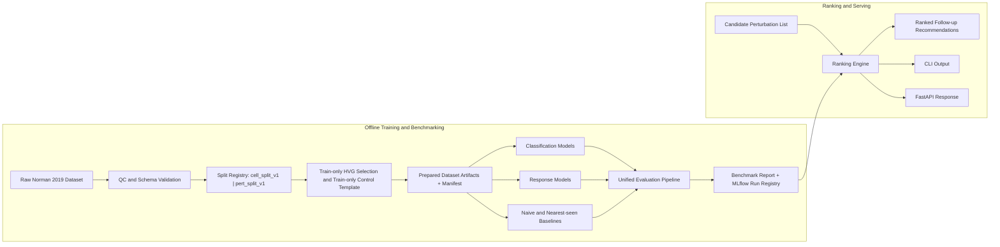
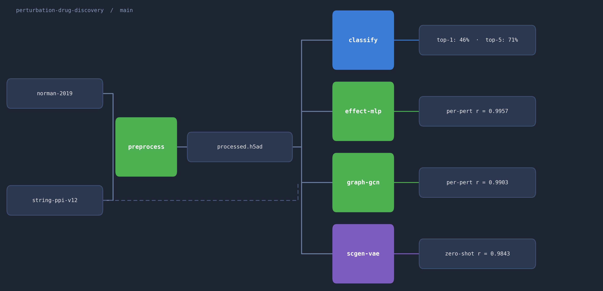
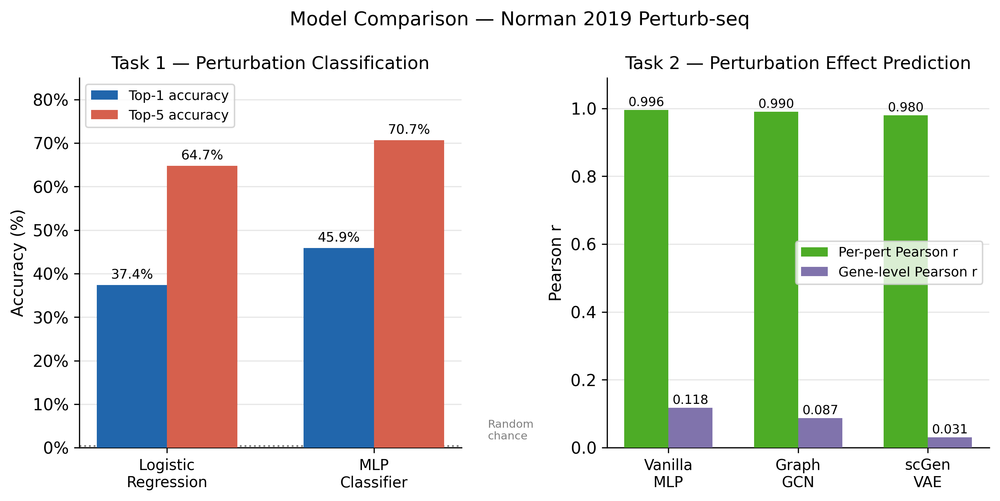
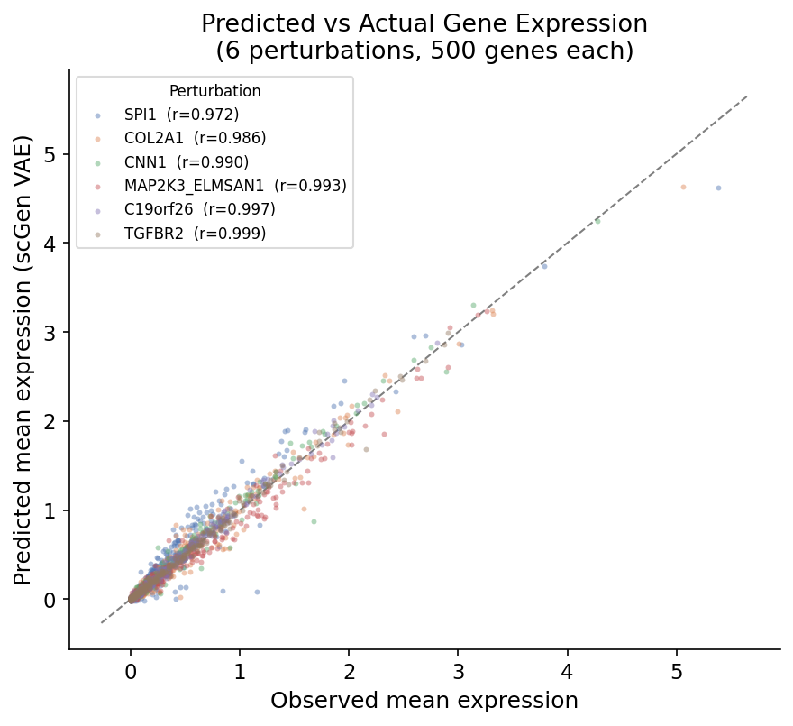

# Perturbation Response Benchmark and Follow-Up Prioritization

Reproducible benchmarking and candidate follow-up ranking for single-cell CRISPR screens.

This repository is being reshaped from a portfolio-style perturbation modeling prototype into an ML engineering project with a stricter contract:

- benchmark perturbation-response models on a fixed public Perturb-seq dataset
- separate known-perturbation and held-out-perturbation evaluation
- compare model predictions against transparent biological baselines
- rank candidate perturbations for wet-lab follow-up with explicit confidence and provenance

## What This Project Is

This project uses the Norman et al. 2019 Perturb-seq dataset to evaluate models that:

- classify perturbations from expression profiles
- predict mean expression responses for perturbations seen in training
- estimate responses for perturbations excluded before training
- rank candidate perturbations for follow-up screening based on predicted effect strength, model agreement, and support

The target user is an ML engineer or computational biologist building internal tooling for assay triage, benchmark reproducibility, and downstream experimental prioritization.

## What This Project Is Not

This repository does **not**:

- discover compounds
- predict efficacy or toxicity
- validate causal biology beyond the public benchmark
- replace wet-lab screening
- make clinical claims

The output is a **follow-up prioritization signal**, not a drug discovery decision engine.

## Benchmark Tasks

The repository now treats these as separate tasks with separate artifacts and acceptance criteria:

1. `classification`
   Predict the perturbation label from a cell expression profile.

2. `response_known`
   Predict mean perturbation response for perturbations present in training data.

3. `response_heldout`
   Predict mean perturbation response for perturbations that were excluded before training.

Each response benchmark must be reported next to baseline comparators, including:

- naive control baseline
- nearest-seen perturbation baseline

## Workflow



## Visual Snapshot

Pipeline overview:



Current benchmark comparison across the model ladder:



Example predicted-versus-observed response view from the current benchmark artifacts:



## Current Dataset

- Dataset: Norman et al. 2019 Perturb-seq
- Cells after QC: ~111k
- Genes: 2,000 HVGs
- Perturbations: 237
- Cell line: K562
- Source: scPerturb-curated NormanWeissman2019 dataset

## Project Roadmap

The implementation is structured around five slices:

1. lock the benchmark specification and project framing
2. add deterministic split manifests and train-only feature selection
3. move orchestration into a shared package and CLI
4. add unified evaluation and candidate ranking
5. add developer tooling, CI, API, and containerized serving

## Documentation

- [Problem definition](docs/problem-definition.md)
- [Benchmark specification](docs/benchmark-spec.md)
- [Architecture](docs/architecture.md)
- [Runbook](docs/runbook.md)

## Quickstart

```bash
python3 -m pip install -e ".[dev]"
python3 -m perturbation_dd prepare-data --config configs/base.yaml --split cell_split_v1
python3 -m perturbation_dd prepare-data --config configs/base.yaml --split pert_split_v1
python3 -m perturbation_dd train --config configs/base.yaml --task classification --model logreg --split cell_split_v1
python3 -m perturbation_dd train --config configs/base.yaml --task response_known --model graph_gcn --split cell_split_v1
python3 -m perturbation_dd evaluate --config configs/base.yaml --run-id <run-id>
python3 -m perturbation_dd build-report --config configs/base.yaml --run-id <run-id>
python3 -m perturbation_dd rank-candidates --config configs/base.yaml --input candidates.json --output ranked.json --split pert_split_v1
uvicorn perturbation_dd.serving.api:app --host 0.0.0.0 --port 8000
```

The ranking interface accepts a JSON payload like:

```json
{
  "candidates": ["KLF1", "CEBPA"]
}
```

## Legacy Artifacts

The repository still contains legacy training and analysis scripts while the new package-first workflow is being introduced. Those scripts remain available as model backends during the migration, but the long-term interface is the CLI under `src/perturbation_dd/`.

## License

MIT
