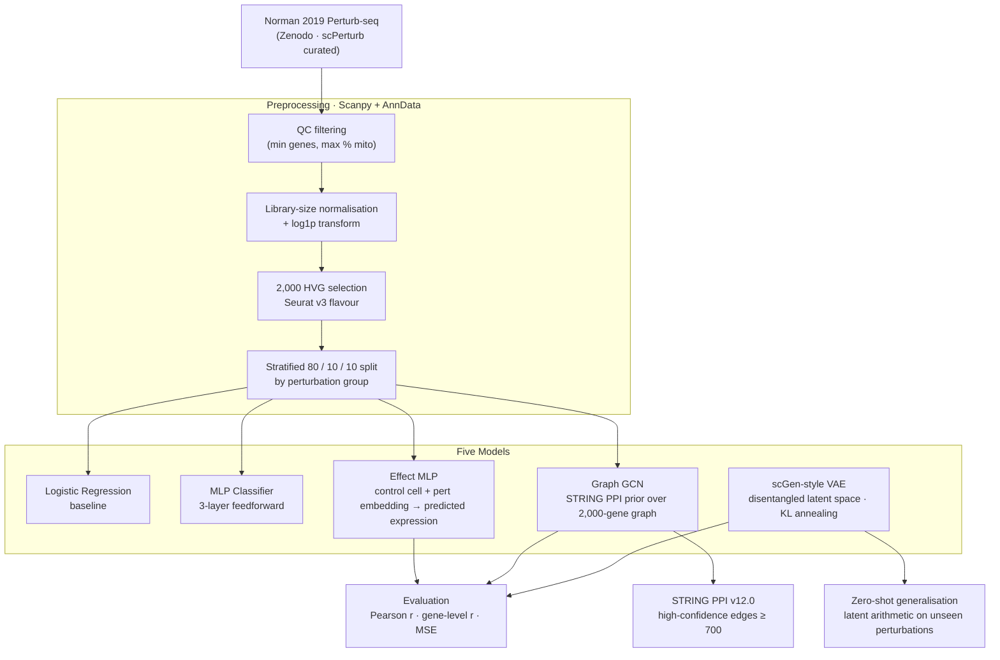

<div align="center">

# Perturbation-Based Drug Target Discovery

**Predicting genome-wide transcriptional responses to CRISPR knockouts with deep learning**

[](https://www.python.org/)
[](https://pytorch.org/)
[](https://scanpy.readthedocs.io/)
[](https://anndata.readthedocs.io/)
[](https://scikit-learn.org/)
[](LICENSE)

*111,391 cells · 2,000 highly variable genes · 237 CRISPR perturbations · K562 cell line*

</div>

---

## The Problem

Wet-lab CRISPR screens are expensive, slow, and can only test one perturbation at a time. If a computational model can reliably predict how a knockout reshapes the transcriptome, you can screen thousands of candidate drug targets in silico before committing to a single experiment.

This project reimplements and benchmarks the core prediction paradigm behind [scGen](https://www.nature.com/articles/s41592-019-0494-8), [CPA](https://www.embopress.org/doi/full/10.15252/msb.202211517), and [GEARS](https://www.nature.com/articles/s41587-023-01905-6) from scratch — five models in increasing architectural complexity, evaluated against a naive baseline with full train / validation / test separation.

---

## Pipeline



---

## Results

### Expression prediction

| Model | Per-pert Pearson r | Gene-level Pearson r | Test MSE |
|---|:---:|:---:|:---:|
| Naive baseline (predict control mean) | 0.9829 | — | — |
| Effect MLP | **0.9957** | 0.118 | 0.077 |
| Graph GCN | 0.9903 | 0.087 | 0.079 |
| scGen VAE | 0.9798 | 0.031 | 0.083 |

### Perturbation classification

| Model | Top-1 | Top-5 | Random chance |
|---|:---:|:---:|:---:|
| Logistic Regression | 37.4% | 64.7% | 0.4% |
| MLP Classifier | **45.9%** | **70.7%** | 2.1% |

### Zero-shot generalisation (44 unseen perturbations)

| Condition | Per-pert Pearson r |
|---|:---:|
| VAE zero-shot (nearest-seen embedding transfer) | **0.9843** |
| VAE oracle (true embedding — upper bound) | 0.9846 |
| Nearest-seen Δ expression baseline | 0.9831 |

> **Reading the numbers.** The naive baseline scores r=0.9829 because most of the 2,000 genes are unaffected by any single knockout — predicting no change is already a strong prior. The meaningful signal is the gap between r=0.9829 and r=0.9957: the Effect MLP captures the specific differential expression patterns that matter. Gene-level Pearson r (< 0.12 across all models) is the harder metric — it measures whether the model correctly ranks individual gene response magnitudes, which is a known limitation of the mean-prediction paradigm used here and in scGen/CPA/GEARS.

---

## Figures

### Predicted vs observed gene expression — scGen VAE


*Each panel is one held-out perturbation, spanning the full range of model performance from r=0.97 to r=0.999. Every point is one of 2,000 genes plotted at 300 dpi. The dashed line is the identity.*

### Model comparison


*Left: perturbation classification top-1 and top-5 accuracy. Right: per-perturbation and gene-level Pearson r for the three generative models. The gene-level bars reveal the gap between predicting direction vs ranking magnitude.*

---

## Models

<details>
<summary><strong>Logistic Regression — linear baseline</strong></summary>

**Task:** classify which of 237 perturbations a cell received from its 2,000-gene expression profile.

**Why it matters:** establishes a linear floor. Achieves 37.4% top-1 / 64.7% top-5 accuracy against a 0.4% random baseline — strong signal that expression profiles are perturbation-discriminative.

**Implementation:** scikit-learn `LogisticRegression` (lbfgs solver, max_iter=1000). No dimensionality reduction — raw 2,000-d HVG vector.

</details>

<details>
<summary><strong>MLP Classifier — neural baseline</strong></summary>

**Task:** same 237-class classification with a three-layer feedforward network.

**Architecture:** `Linear(2000→512) → ReLU → Dropout(0.3) → Linear(512→256) → ReLU → Dropout(0.3) → Linear(256→237)`

**Result:** 45.9% top-1 (+8.5 pp over logistic regression), confirming the expression signal supports neural modelling. Serves as the diagnostic model: if MLP can't beat logistic regression, deeper architectures are not warranted.

</details>

<details>
<summary><strong>Effect MLP — best overall performance</strong></summary>

**Task:** given a control cell and a perturbation identity, predict the full 2,000-gene post-perturbation expression profile.

**Architecture:**
```
control_expr (2000) ──► Linear(2000→512) ──► ReLU ──────────────────┐
                                                                      ├─ concat
pert_id ──► Embedding(237, 64) ──────────────────────────────────────┘
         ──► Linear(576→512) ──► ReLU ──► Dropout(0.3) ──► Linear(512→2000)
```

**Training:** pairs are sampled as (random control cell, perturbed cell), so the model sees diverse baseline contexts per epoch rather than a fixed mean. Evaluation uses the mean control cell as a deterministic reference.

**Loss:** MSELoss. Optimiser: Adam (lr=1e-3). Per-pert Pearson r=0.9957.

</details>

<details>
<summary><strong>Graph GCN — STRING PPI biological prior</strong></summary>

**Task:** same as Effect MLP, but the perturbation representation is derived from the protein interaction neighbourhood of the target gene rather than a learned embedding.

**Graph construction:** STRING PPI v12.0, human (taxon 9606), edges with combined score ≥ 700 (high confidence). Restricted to HVG–HVG interactions. Normalised adjacency à = D⁻½(A+I)D⁻½.

**Architecture:**
```
gene embeddings (2000, 64)
  ──► GCNLayer(64→128) ──► ReLU ──► Dropout
  ──► GCNLayer(128→64)
  ──► pert neighbourhood mean-pooling → pert_graph_feat (64)

control_expr ──► Linear(2000→512) ──► concat(512+64) ──► Linear(576→512) ──► Linear(512→2000)
```

**Note:** implemented from scratch using normalised matrix multiplication — no PyTorch Geometric dependency. Result (r=0.9903) suggests the PPI prior does not add signal beyond what the data already encodes at this scale.

</details>

<details>
<summary><strong>scGen-style VAE — zero-shot generalisation</strong></summary>

**Task:** learn a disentangled latent space where perturbation effects are additive shifts, enabling prediction for perturbations not seen during training.

**Architecture:**
```
Encoder:  Linear(2000→512) → ReLU → Linear(512→256) → ReLU → μ(128), logvar(128)
Reparam:  z = μ + ε·exp(½ logvar),  ε ~ N(0, I)
Decoder:  concat(z:128, pert_emb:64) → Linear(192→256) → ReLU → Linear(256→512) → ReLU → Linear(512→2000)
```

**Loss:** ELBO = MSE(recon, target) + β · KL. β is annealed linearly from 0 → 1×10⁻⁴ over the first 10 epochs to prevent posterior collapse before the reconstruction loss stabilises.

**Inference:** `encode(mean_ctrl) → z_ctrl → decode(z_ctrl, pert_emb[p])` — the perturbation is applied as an additive operator in latent space, following the scGen paradigm.

**Zero-shot:** for unseen perturbations, the embedding of the nearest seen perturbation (by STRING PPI gene proximity, fallback to expression-space cosine similarity) is used. Achieves r=0.9843, within 0.0003 of the oracle upper bound.

</details>

---

## Tech Stack

| Category | Tool | Role |
|---|---|---|
| Single-cell analysis | [Scanpy](https://scanpy.readthedocs.io/) + [AnnData](https://anndata.readthedocs.io/) | QC, normalisation, HVG selection, h5ad I/O |
| Deep learning | [PyTorch](https://pytorch.org/) 2.0 | MLP, GCN, VAE — all implemented from scratch |
| Classical ML | [scikit-learn](https://scikit-learn.org/) | Logistic regression baseline, label encoding |
| Biological network | [STRING PPI v12.0](https://string-db.org/) | Protein interaction graph for GCN prior |
| Numerical | NumPy · SciPy | Pearson r, sparse matrix ops, stratified split |
| Visualisation | Matplotlib · Seaborn | Publication-quality figures at 300 dpi |
| Config | PyYAML | Single `configs/default.yaml` — all hyperparameters in one place |
| Data format | h5py · zarr · AnnData HDF5 | Compressed `.h5ad` for processed single-cell data |

---

## Project Structure

```
perturbation-drug-discovery/
├── configs/
│   └── default.yaml                         # all hyperparameters — edit here, not in code
├── src/
│   ├── constants.py                         # reads default.yaml, shared across all scripts
│   ├── data/
│   │   ├── download_norman2019.py           # fetches dataset from Zenodo
│   │   ├── download_string_ppi.py           # queries STRING API, filters to HVGs
│   │   ├── prepare_perturbation_dataset.py  # QC → normalise → HVG → split
│   │   └── preprocessor.py
│   ├── models/
│   │   ├── train_baseline_classifier.py     # logistic regression
│   │   ├── train_mlp_classifier.py          # MLP classifier
│   │   ├── train_perturbation_effect_model.py  # Effect MLP (best r)
│   │   ├── train_graph_perturbation_model.py   # Graph GCN + STRING PPI
│   │   └── train_scgen_style_model.py       # VAE with KL annealing
│   ├── experiments/
│   │   └── unseen_perturbation_generalization.py  # zero-shot eval on 44 held-out perts
│   └── analysis/
│       ├── visualize_results.py             # generates all three figures
│       └── interpret_perturbation_results.py
├── data/
│   ├── raw/          # downloaded h5ad (gitignored, ~2 GB)
│   ├── processed/    # normalised AnnData (gitignored)
│   ├── external/     # STRING PPI TSV (gitignored)
│   ├── models/       # .pt checkpoints (gitignored)
│   └── results/      # metrics JSON per model (gitignored)
├── reports/figures/  # committed PNGs at 300 dpi
└── Makefile
```

---

## Quickstart

```bash
# Environment
make install          # creates .venv and installs requirements

# Data (~2 GB download)
make data             # downloads Norman 2019 h5ad + STRING PPI TSV

# Preprocessing
make preprocess       # QC → normalise → HVG → 80/10/10 stratified split

# Training (runs all five models sequentially)
make train

# Tests
make test
```

Individual scripts:
```bash
source .venv/bin/activate

# Train a specific model
python src/models/train_perturbation_effect_model.py
python src/models/train_scgen_style_model.py

# Zero-shot evaluation (requires scgen_model.pt)
python src/experiments/unseen_perturbation_generalization.py

# Regenerate all figures
python src/analysis/visualize_results.py
```

---

## Dataset

**Norman et al. 2019 Perturb-seq** — [Science 365:786–793](https://doi.org/10.1126/science.aax4438)

CRISPRi screen in K562 cells profiling 237 single and combinatorial gene knockouts with single-cell RNA-seq. Curated via [scPerturb](https://projects.sanderlab.org/scperturb/).

| | |
|---|---|
| Cells (post-QC) | 111,391 |
| Genes (HVGs) | 2,000 (Seurat v3) |
| Perturbations | 237 (single + combinatorial knockouts) |
| Cell line | K562 — chronic myelogenous leukaemia |
| Train / Val / Test | 80% / 10% / 10% stratified by perturbation |
| Source | Zenodo [`10.5281/zenodo.7041849`](https://zenodo.org/record/7041849) |

---

## Known Limitations

- **Gene-level Pearson r < 0.12** — direction of perturbation effects is captured well; ranking individual gene magnitudes is not reliable. Downstream drug target ranking requires a dedicated differential expression step.
- **Double perturbations underfit** — combinatorial knockouts have fewer cells per condition, producing noisier training signal.
- **Cell-line specific** — all results are on K562. Generalisation to primary cells or other lines is untested.
- **No compound mapping** — pipeline is gene-centric; translating knockouts to small-molecule inhibitors requires external databases (ChEMBL, DGIdb).

---

## License

MIT — see [LICENSE](LICENSE).
