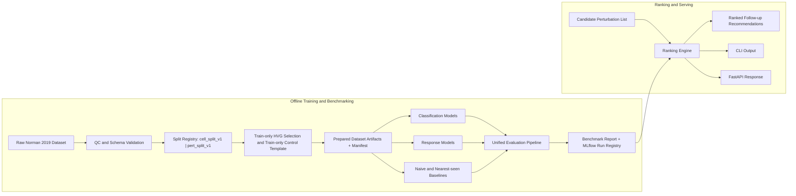

# Architecture

## Overview

The project is organized around four layers:

1. data preparation
2. model training backends
3. unified evaluation and reporting
4. candidate ranking and serving

The initial migration keeps legacy model scripts as training backends while moving orchestration, manifests, evaluation, and ranking into a shared package.

## Workflow Diagram



## Package Layout

The target package layout is:

```text
src/perturbation_dd/
  data/
  splits/
  models/
  training/
  evaluation/
  ranking/
  serving/
  utils/
```

## Artifact Strategy

Prepared datasets, manifests, runs, and reports are treated as generated artifacts rather than committed source files.

Each run should have:

- prepared dataset manifest
- run metadata
- model outputs and metrics
- evaluation summary
- report artifacts

## Migration Strategy

Short term:

- reuse legacy model scripts as backend runners
- add a shared CLI and run registry
- centralize preparation, manifests, evaluation, and ranking

Long term:

- pull legacy model logic into package modules
- keep top-level scripts as thin compatibility entrypoints only
